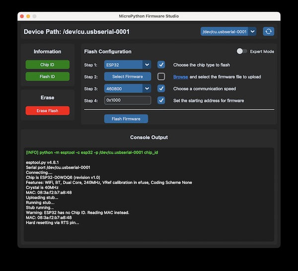
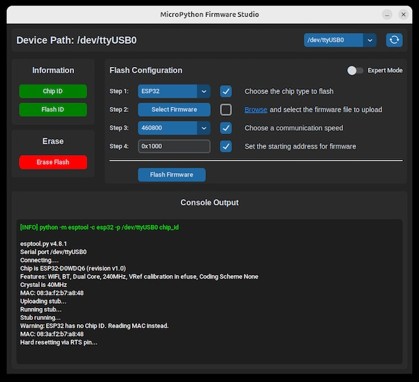
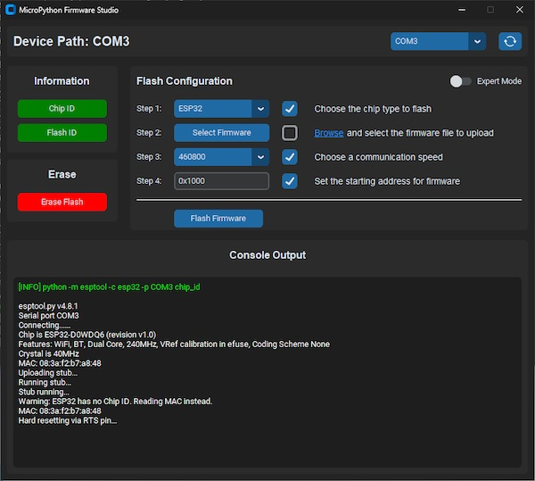

# MicroPython Firmware Studio


[](https://docs.espressif.com/projects/esptool/en/latest/esp32/)
[](https://python.org)

## Overview

**MicroPython Firmware Studio** is a modern, cross-platform GUI application designed to simplify the process of configuring, managing, and flashing MicroPython firmware to microcontroller devices.

### Features

- Clean and intuitive GUI
- Supporting device detection
- Firmware download support
- Simple and expert mode can be set at any time
- Compatible with many ESP microcontrollers
- Configurable features, appearance and device and OS support
- Open source extensibility for community-driven growth

### Requirements

- [Python 3](https://www.python.org)
- [Silicon Labs CP210x VCP drivers](https://www.silabs.com/developer-tools/usb-to-uart-bridge-vcp-drivers?tab=downloads)

### Supported Devices

Supported devices include ESP chips in the variants ESP8266, ESP32, ESP32-S2, ESP32-S3, ESP32-C3, and ESP32-C6, with specific flash sector configurations.

## Installation

On the [Wiki](https://github.com/Lupin3000/MicroPython-Firmware-Studio/wiki/Installation), you will find detailed instruction for macOS, Linux, and Windows.

### Quick installation

> Clone the repository from GitHub, create a virtual Python environment, and install all required dependencies.

```shell
# clone repository
$ git clone https://github.com/Lupin3000/MicroPython-Firmware-Studio.git

# change into cloned root directory
$ cd MicroPython-Firmware-Studio/

# create Python virtualenv (optional but recommended)
$ python3 -m venv .venv

# activate Python virtualenv (macOS & Linux)
$ source venv/bin/activate

# activate Python virtualenv (Windows)
$ .\.venv\Scripts\activate

# update pip (optional)
(.venv) $ pip3 install -U pip

# install required dependencies
(.venv) $ pip3 install -r requirements.txt

# show packages (optional)
(.venv) $ pip3 freeze
```

## Usage

> Start the application using the command in your terminal within the configured Python environment.

```shell
# run application
(.venv) $ python3 main.py
```

After MicroPython firmware flashing was successful you can use `rshell` to connect.

```shell
# connect to device
(.venv) $ rshell -p <PORT>
```

## Preview

> Preview: macOS
>
> 

> Preview: Linux
> 
> 

> Preview: Windows
> 
> 

## Important

**MicroPython Firmware Studio is provided without any guarantee.** Use it at your own risk. The developer assumes no liability for any damage or legal consequences resulting from using the software. Please ensure compliance with all applicable laws and regulations when using this tool.
