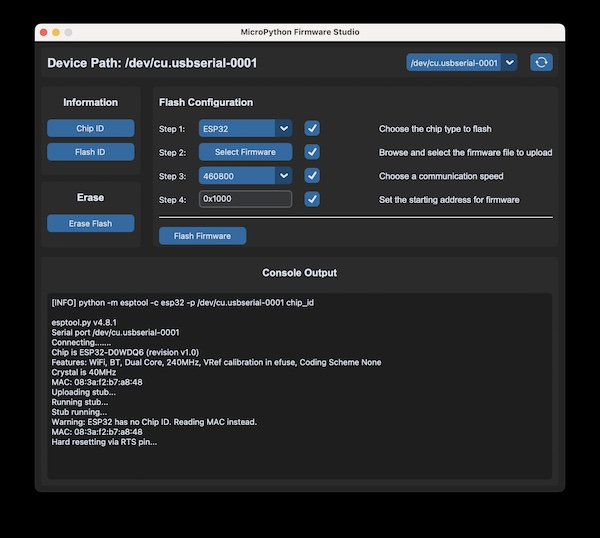

# MicroPython Firmware Studio


## Preview



The **MicroPython Firmware Studio** is a user-friendly application designed for the management and configuration of ESP microcontrollers. This software enables efficient firmware development and seamless flashing of MicroPython firmware onto ESP chips.

## Important

**MicroPython Firmware Studio is provided without any guarantee.** Use it at your own risk. The developer assumes no liability for any damage or legal consequences resulting from using the software. Please ensure compliance with all applicable laws and regulations when using this tool.

## Supported Devices

Supported devices include ESP chips in the variants ESP32, ESP32-S2, ESP32-S3, ESP32-C3, and ESP32-C6, with specific flash sector configurations.

## Installation

### Prerequisite

The latest [VCP driver](https://www.silabs.com/developer-tools/usb-to-uart-bridge-vcp-drivers?tab=downloads) needs to be installed.

### Minimum requirements

The code is written and tested with the following requirements:

| OS     | Python                                                                                                                        |
|--------|-------------------------------------------------------------------------------------------------------------------------------|
| macOS  | [](https://python.org)                                           | 
| macOS  | [](https://docs.espressif.com/projects/esptool/en/latest/esp32/) |
| macOS  | [](https://customtkinter.tomschimansky.com)                |
| macOS  | [](https://python-pillow.github.io)                              |

### Quick installation

> Clone the repository from GitHub, create a virtual Python environment, and install all required dependencies.

```shell
# clone repository
$ git clone https://github.com/Lupin3000/MicroPython-Firmware-Studio.git

# change into cloned root directory
$ cd MicroPython-Firmware-Studio/

# create Python virtualenv (optional but recommended)
$ python3 -m venv .venv

# activate Python virtualenv
$ source venv/bin/activate

# update pip (optional)
(.venv) $ pip3 install -U pip

# install required dependencies
(.venv) $ pip3 install -r requirements.txt

# show packages (optional)
(.venv) $ pip3 freeze
```

## Usage

> Start the application using the command in your terminal within the configured Python environment.

```shell
# run application
(.venv) $ python3 main.py
```

After MicroPython firmware flashing was successful you can use `rshell` to connect.

```shell
# connect to device
(.venv) $ rshell -p <PORT>
```
